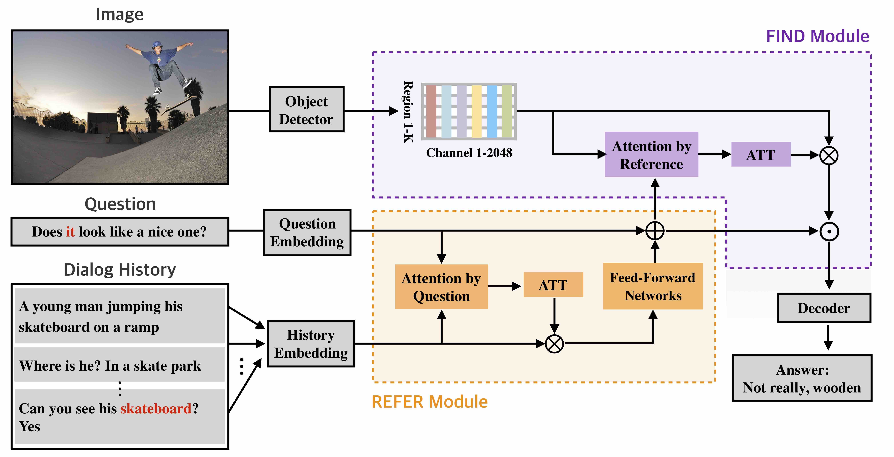

DAN-Visdial
========================================================================

PyTorch implementation for the [Dual Attention Networks for Visual Reference Resolution in Visual Dialog][1]. <br>
For the visual dialog v1.0 dataset, our single model achieved **57.59** on NDCG and **49.63** on Recall@1.   



If you use this code in your published research, please consider citing:
```text
@article{kang2019dual,
  title={Dual Attention Networks for Visual Reference Resolution in Visual Dialog},
  author={Kang, Gi-Cheon and Lim, Jaeseo and Zhang, Byoung-Tak},
  journal={arXiv preprint arXiv:1902.09368},
  year={2019}
}
```

Setup and Dependencies
----------------------
This starter code is implemented using **PyTorch v0.3.1** with **CUDA 8 and CuDNN 7**. <br>
It is recommended to set up this source code using Anaconda or Miniconda. <br>

1. Install Anaconda or Miniconda distribution based on Python 3.6+ from their [downloads' site][2].
2. Clone this repository and create an environment:

```sh
git clone https://github.com/gicheonkang/DAN-VisDial
conda create -n dan_visdial python=3.6

# activate the environment and install all dependencies
conda activate dan_visdial
cd DAN-VisDial/
pip install -r requirements.txt
```

Download Features
----------------------
1. We used the bottom-up attention features as image features. Download the image features below, and put these under each `$PROJECT_ROOT/data/{split name}_feature` directory. 

  * [`train_btmup_f.hdf5`][3]: Bottom-up features of 10-100 proposals from images of `train` split.
  * [`val_btmup_f.hdf5`][4]: Bottom-up features of 10-100 proposals from images of `validation` split. 
  * [`test_btmup_f.hdf5`][5]: Bottom-up features of 10-100 proposals from images of `test` split. 

2. Download the GloVe pretrained word vectors from [here][6], and keep `glove.6B.300d.txt` under `$PROJECT_ROOT/data/glove` directory.

Data preprocessing & GloVe embedding initialization
----------------------
```sh
# data preprocessing
cd DAN-VisDial/data/
python prepro.py

# Word embedding vector initialization (GloVe)
cd ../utils
python utils.py
```

Training
--------
Simple run
```sh
python train.py 
```

### Saving model checkpoints  
By default, our model save model checkpoints at every epoch. You can change it by using `-save_step` option. 

### Logging
Logging data `checkpoints/start/training/time/log.txt` shows epoch, loss, and learning rate.

Evaluation
--------
Evaluation of a trained model checkpoint can be evaluated as follows:
```sh
python evaluate.py -load_path /path/to/.pth -split {val or test}
```
Validation scores can be checked in offline setting. But if you want to see the test-split score, you have to submit a json file to [online evaluation server][7]. You can make json format with `-save_ranks` option. 

[1]: https://arxiv.org/abs/1902.09368
[2]: https://conda.io/docs/user-guide/install/download.html
[3]: https://drive.google.com/file/d/1NYlSSikwEAqpJDsNGqOxgc0ZOkpQtom9/view?usp=sharing
[4]: https://drive.google.com/file/d/1NI5TNKKhqm6ggpB2CK4k8yKiYQE3efW6/view?usp=sharing
[5]: https://drive.google.com/file/d/1BXWPV3k-HxlTw_k3-kTV6JhWrdzXsT7W/view?usp=sharing
[6]: http://nlp.stanford.edu/data/glove.6B.zip 
[7]: https://evalai.cloudcv.org/web/challenges/challenge-page/161/overview
